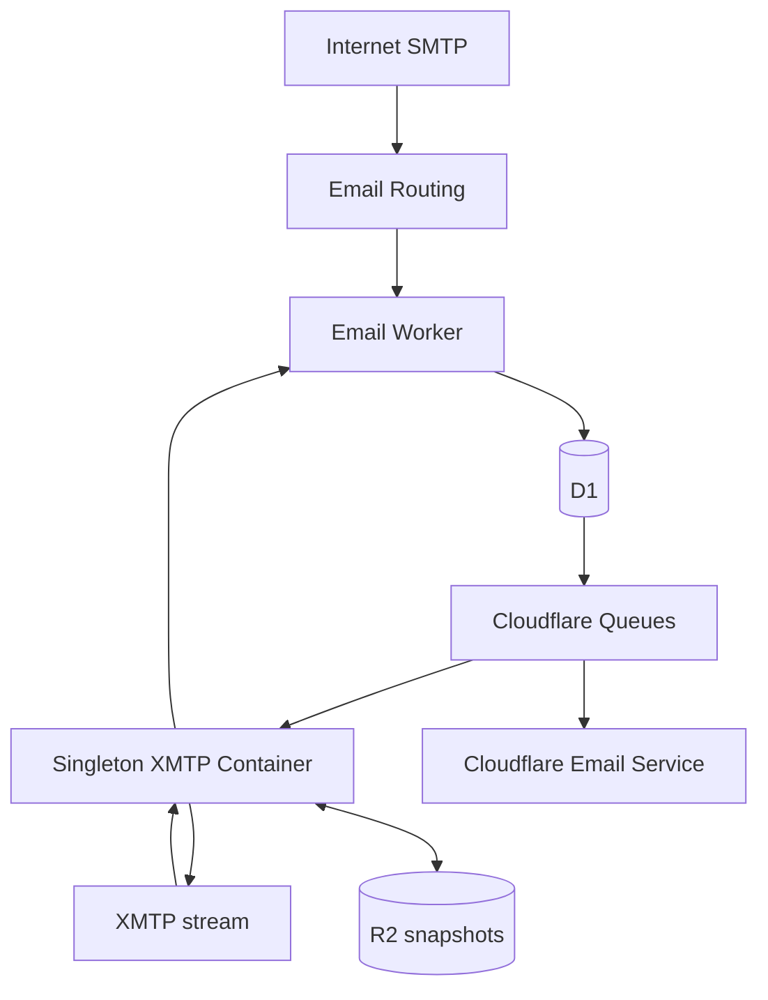

# Cloudflare relay edge

This directory contains the Cloudflare-native edge half of the xmtp.mx relay. It replaces the obsolete scheduled XMTP poller and Mailgun integration with:

- Cloudflare Email Routing for inbound SMTP;
- D1 for application state, deduplication, and durable outboxes;
- Cloudflare Queues for asynchronous email and XMTP delivery;
- Cloudflare Email Service through the native `send_email` binding;
- one singleton Cloudflare Container running the real `@xmtp/node-sdk` stream;
- R2 for consistent XMTP database snapshots; and
- a one-minute watchdog Cron Trigger that starts or checks the Container and repairs D1-to-Queue handoff gaps. It never polls XMTP.



The Container instance name is fixed to `xmtp-mx-relay-production`, `max_instances = 1`, and normal production starts require both the expected XMTP inbox ID and installation ID. The Container keeps its active SQLite files on local disk and restores them from a verified R2 snapshot before constructing the XMTP client.

## Resource contract

| Binding | Production resource | Purpose |
| --- | --- | --- |
| `RELAY_DB` | `xmtp-mx-relay-production` | Relay application state and idempotency |
| `XMTP_STATE_BUCKET` | `xmtp-mx-xmtp-state-production` | Consistent XMTP DB snapshots and bootstrap marker |
| `EMAIL_DELIVERY_QUEUE` | `xmtp-mx-email-delivery-production` | `email.send.v1` delivery |
| `XMTP_DELIVERY_QUEUE` | `xmtp-mx-xmtp-delivery-production` | `email.inbound.v1` and `email.send.result.v1` delivery |
| `EMAIL` | native Email Service binding | Controlled outbound email |
| `XMTP_RELAY` | `XmtpRelayContainer` Durable Object | Stable Container ownership and lifecycle |

The two dead-letter queues are `xmtp-mx-email-delivery-dlq-production` and `xmtp-mx-xmtp-delivery-dlq-production`. This Worker consumes both, upserts a `queue_failure` row, and writes a structured error log. A DLQ consumer terminalizes only a pending state with a compare-and-set transition; it never overwrites a concurrent `sent`/`delivered` result or immediately guesses the outcome of `sending`/`delivering`. The long-aged watchdog quarantines abandoned in-flight claims without resending them.

## Provisioning

Run these commands from `cf-worker/` after logging in with Wrangler:

```sh
npm ci
npx wrangler d1 create xmtp-mx-relay-production
npx wrangler r2 bucket create xmtp-mx-xmtp-state-production
npx wrangler queues create xmtp-mx-email-delivery-production
npx wrangler queues create xmtp-mx-email-delivery-dlq-production
npx wrangler queues create xmtp-mx-xmtp-delivery-production
npx wrangler queues create xmtp-mx-xmtp-delivery-dlq-production
```

Replace `REPLACE_WITH_D1_DATABASE_ID` in `wrangler.toml` with the returned D1 ID, then apply the migration:

```sh
npx wrangler d1 migrations apply RELAY_DB --remote --config wrangler.toml
```

The Container image path is `../container/Dockerfile` because Wrangler resolves it relative to this configuration file.

### Secrets

Set every secret through Wrangler; do not put values in `wrangler.toml` or source control:

```sh
npx wrangler secret put CONTAINER_SHARED_SECRET --config wrangler.toml
npx wrangler secret put RELAY_ADMIN_TOKEN --config wrangler.toml
npx wrangler secret put RECOVERY_ADMIN_TOKEN --config wrangler.toml
npx wrangler secret put XMTP_BOT_KEY --config wrangler.toml
npx wrangler secret put XMTP_EXPECTED_INBOX_ID --config wrangler.toml
npx wrangler secret put XMTP_EXPECTED_INSTALLATION_ID --config wrangler.toml
npx wrangler secret put XMTP_SNAPSHOT_SIGNING_KEY --config wrangler.toml
```

`CONTAINER_SHARED_SECRET` authenticates only the private Container-to-Worker event and R2 interfaces. `RELAY_ADMIN_TOKEN` authenticates status, lifecycle controls, and forced backups. The separately rotated `RECOVERY_ADMIN_TOKEN` authenticates the short-lived, explicitly gated offline snapshot import surface. The independent high-entropy `XMTP_SNAPSHOT_SIGNING_KEY` is required to authenticate canonical snapshot manifests; it must not reuse either interface bearer token. Rotate these independently and only through Cloudflare Secrets. `ETH_RPC_URL` may also be set as a secret when configured.

`XMTP_ALLOWED_SENDERS` must contain comma-separated, verified 64-hex XMTP inbox IDs. ENS names and `0x` wallet addresses are intentionally rejected because the edge does not resolve them or verify their association with an inbox.

## D1 migration from relay.sqlite

The checked-in exporter reads the legacy database without modifying it and emits idempotent D1 SQL:

```sh
python3 scripts/export_legacy_d1.py /absolute/path/to/relay.sqlite > legacy-relay-d1.sql
npx wrangler d1 execute RELAY_DB --remote --file legacy-relay-d1.sql --config wrangler.toml
```

The exporter fails closed when it finds an unresolved legacy allowlist value or a nonterminal legacy outbound request. Drain the existing Railway relay and rerun the export; do not hand-edit a pending row into a terminal state. A legacy `sending` row is imported as `uncertain` because its external delivery state cannot be proven. Import while MX still points to Mailgun, then compare source/D1 row counts before proceeding.

D1 owns these tables:

- `inbound_email`: inbound normalization, dedupe key, status, attempts, and XMTP result;
- `outbound_request`: XMTP message dedupe, allowlist outcome, email request, provider ID, status, and result delivery;
- `allowlist_xmtp` and `thread_map`;
- `delivery_job`: durable XMTP outbox for inbound mail and send results;
- `queue_failure`: dead-letter visibility; and
- `relay_state`: watchdog and last-delivery observations; and
- `snapshot_anchor`: the independent monotonic snapshot ID/timestamp/digest anchor used to reject a validly signed R2 rollback.

`delivery_job.job_id` is deterministic (`inbound:<D1 id>` or `result:<XMTP message id>`). Queue messages carry only the durable record identifier:

```json
{ "version": 1, "kind": "email_delivery", "xmtpMessageId": "..." }
```

```json
{ "version": 1, "kind": "xmtp_delivery", "jobId": "inbound:123" }
```

## Private interfaces

Wrangler publishes the Worker on its account-specific `workers.dev` hostname; this repository does not assume an unprovisioned relay subdomain. Capture the deployment URL in `SMOKE_EDGE_URL`. Public `/healthz` reports only edge/D1 liveness. Every privileged route requires a bearer token. Email Routing targets the Worker by script name and does not depend on the HTTP hostname.

| Method and path | Token | Purpose |
| --- | --- | --- |
| `GET /healthz` | none | Minimal edge liveness |
| `POST /internal/v1/xmtp/events` | `CONTAINER_SHARED_SECRET` | Container submits a streamed XMTP event |
| `GET /internal/v1/status` | `RELAY_ADMIN_TOKEN` | Container/D1/Queue delivery state and recent IDs |
| `POST /internal/v1/container/backup` | `RELAY_ADMIN_TOKEN` | Force a verified Container snapshot before a handoff or rollback |
| `POST /internal/v1/container/start` | `RELAY_ADMIN_TOKEN` | Resume watchdog and start the singleton |
| `POST /internal/v1/container/stop` | `RELAY_ADMIN_TOKEN` | Pause watchdog and stop for rollback |
| `POST /internal/v1/container/restart` | `RELAY_ADMIN_TOKEN` | Gated recovery drill using the same named instance |
| `POST /internal/v1/container/recreate` | `RELAY_ADMIN_TOKEN` | Gated fresh-filesystem/R2 recovery drill |
| `GET\|PUT /internal/v1/admin/recovery/objects/<encoded-key>` | `RECOVERY_ADMIN_TOKEN` | Paused, stopped-Container offline snapshot read/import |

Authenticated status includes D1 counts, recent delivery records, recent `queue_failure` rows, and the oldest pending, retrying, or in-flight timestamp and age for each durable work table. `container.watchdogConfigured` is `false` and `watchdogPaused` is `null` when the activation row is absent or malformed; automation must not mistake that state for an enabled listener. Those fields expose relay backlog age, not Cloudflare broker depth; use Cloudflare Queue metrics/dashboard for the actual ready, in-flight, retry, and DLQ message counts.

Container-to-edge events use:

```json
{
  "messageId": "XMTP message id",
  "senderInboxId": "64-hex inbox id",
  "conversationId": "XMTP conversation id",
  "content": "serialized email.send.v1",
  "receivedAt": "2026-08-27T00:00:00.000Z"
}
```

Worker-to-Container delivery uses `POST /internal/v1/xmtp/deliver` with the shared bearer token:

```json
{
  "jobId": "inbound:123",
  "kind": "email.inbound.v1",
  "payload": {},
  "conversationId": "optional",
  "recipientInboxId": "optional"
}
```

The R2 virtual service accepts authenticated `GET` and `PUT` at `http://xmtp-r2.internal/v1/objects/<encoded-key>`. PUT requires an exact `Content-Length`, a 64-hex `x-object-sha256`, buffers at most one bounded part, and verifies the actual byte count and SHA-256 before writing R2. Every non-`latest.json` PUT also requires `If-None-Match: *`, and the bridge itself enforces an R2 create-only condition; authenticated callers cannot overwrite a snapshot part, immutable manifest, pin, or bootstrap-attempt marker. GET rechecks the stored byte count and digest. Keys are restricted to `XMTP_R2_PREFIX`. `MAX_XMTP_BACKUP_PART_BYTES` defaults to 16 MiB and is hard-capped at 32 MiB for each HTTP object; `MAX_XMTP_BACKUP_BYTES` remains the independent total database/snapshot budget passed to the Container.

For signed v2 `latest.json`, D1 atomically accepts only an idempotent identical publication or a strictly newer `createdAt`; an older/equal different snapshot receives `409`. D1 is the authoritative mutable pointer: latest publication first proves the byte-identical immutable `snapshots/<snapshotId>/manifest.json`, then advances only the D1 anchor and does not overwrite an R2 latest object. Every latest GET serves and revalidates the D1-anchored immutable manifest, so rolling a mutable R2 object back cannot affect recovery. A missing D1 anchor returns snapshot absence without reading mutable R2; normal production then fails closed because new installation is disabled. The anchor is established only by an authenticated paused recovery PUT, never reconstructed from mutable R2 state. Unsigned v1 snapshots are never accepted.

### Lifecycle controls

All controls require this exact body field:

```json
{ "confirm": "xmtp-mx-relay-production" }
```

`stop` also requires `"pauseWatchdog": true`; it durably pauses the watchdog before stopping the Container. `start` writes the explicit valid `paused:false` activation state before starting. A missing, corrupt, or wrong-shaped `watchdog_pause` row fails closed: neither the Cron watchdog nor an XMTP Queue delivery will start/contact the Container. Consequently, an accidental direct Worker deploy cannot activate a second listener while Railway is still running. `restart` and `recreate` require `RECOVERY_DRILL_ENABLED = "true"` and this second identity confirmation:

```json
{
  "confirm": "xmtp-mx-relay-production",
  "expectedInboxId": "the configured XMTP_EXPECTED_INBOX_ID"
}
```

Return `RECOVERY_DRILL_ENABLED` to `false` immediately after a drill.

A forced snapshot requires an explicit reason and the singleton confirmation:

```json
{
  "confirm": "xmtp-mx-relay-production",
  "reason": "pre-cutover-final-handoff"
}
```

The edge forwards that request only over the private Container interface. The reason must be 1–200 non-whitespace characters.

## Email configuration

In the Cloudflare dashboard:

1. Onboard `xmtp.mx` and the controlled sender `deanpierce.eth@xmtp.mx` for Cloudflare Email Service.
2. Confirm the native `EMAIL` binding can send only from that address.
3. Seed and verify the durable watchdog pause, then deploy the Worker without starting the Container.
4. Configure literal Email Routing rules for `deanpierce.eth@xmtp.mx` and `deanpierce@xmtp.mx` to invoke `xmtp-mx-relay-edge`, and enable Cloudflare's apex MX records. `INBOUND_EMAIL_TO` contains the same comma-separated addresses; both deliver to the configured `XMTP_DEAN_ADDRESS`.
5. Verify MX, SPF, DKIM, and DMARC with independent DNS plus a real SMTP message and D1 read-back.

The Worker forces `EMAIL_FROM`; an XMTP request cannot select an arbitrary From address. It preserves `to`, `cc`, `bcc`, `subject`, `text`, `html`, and `replyTo`. `email.send.result.v1.providerMessageId` contains the native Cloudflare Email Service `messageId`.

Inbound raw MIME is size-checked, parsed, normalized, and committed to D1 before the handler returns. Attachments are not relayed. The dedupe key hashes the canonical SMTP envelope plus exact raw MIME; sender-controlled Message-ID is retained as metadata/thread context but is not trusted as the uniqueness boundary. While the watchdog is paused or unconfigured, the durable delivery job remains `received` and no Queue retry budget is spent. After explicit activation, the watchdog publishes held jobs. The Queue receives only a D1 job ID, and replay repairs a D1-commit/Queue-send gap without creating another `email.inbound.v1` message.

## XMTP snapshot migration and bootstrap safety

For production migration, do not register a new installation:

1. Keep `XMTP_ALLOW_NEW_INSTALLATION = "false"`.
2. Quiesce the existing Railway listener so only one production stream can run.
3. Create a consistent SQLite backup using the relay's backup/checkpoint procedure; never copy a live SQLite main file independently of its WAL.
4. Upload the immutable multipart snapshot, signed manifest, and `xmtp-inbox-id.txt` under `XMTP_R2_PREFIX`, then publish the exact signed manifest as `latest.json` through the recovery API last so D1 advances its monotonic anchor.
5. Set `XMTP_EXPECTED_INBOX_ID` and `XMTP_EXPECTED_INSTALLATION_ID` from the known production identity.
6. Start the Cloudflare Container without changing MX. It must restore and verify the manifest, inbox file, client inbox ID, and client installation ID before `/readyz` succeeds.
7. Run both restart and recreate recovery drills. Confirm the same inbox and installation and a successful post-recovery backup before proceeding.

The production default snapshot interval is one hour, with a two-hour readiness staleness threshold. Each consistent snapshot briefly quiesces and restarts the XMTP child, so do not shorten this cadence until production measurements show the pause, restart, catch-up duration, R2 volume, and recovery-point objective justify it.

The Container reserves 64 MiB of local free-space margin before staging a snapshot (`XMTP_FREE_SPACE_MARGIN_BYTES=67108864`). The signed v2 manifest is authenticated with the required independent `XMTP_SNAPSHOT_SIGNING_KEY`; R2 signatures by themselves are not treated as freshness proof.

### Paused offline snapshot import

Use the recovery object API for both an initial seed and a later final handoff. Direct R2 uploads cannot advance an existing D1 freshness anchor. The API is disabled by default and refuses every request unless all three conditions hold: `RECOVERY_IMPORT_ENABLED="true"`, D1 `watchdog_pause.paused=true`, and the stable Container state is exactly `stopped`. A PUT additionally requires `x-recovery-confirm: xmtp-mx-relay-production`; GET still requires the recovery bearer token.

Before the first deploy, seed the pause after applying the D1 migration:

```sh
npx wrangler d1 execute RELAY_DB --remote --config wrangler.toml --file scripts/pause-watchdog.sql
npx wrangler d1 execute RELAY_DB --remote --config wrangler.toml --command "SELECT key,value,updated_at FROM relay_state WHERE key='watchdog_pause';"
```

Do not rely on a one-off `--var` override during recovery. Create a same-directory temporary copy of the complete Wrangler configuration so every other variable and binding remains present:

```sh
RECOVERY_CONFIG="$(mktemp ./wrangler.recovery.XXXXXX.toml)"
sed 's/^RECOVERY_IMPORT_ENABLED = "false"$/RECOVERY_IMPORT_ENABLED = "true"/' wrangler.toml > "$RECOVERY_CONFIG"
grep '^RECOVERY_IMPORT_ENABLED = "true"$' "$RECOVERY_CONFIG"
npx wrangler deploy --config "$RECOVERY_CONFIG"
rm "$RECOVERY_CONFIG"
```

For each exporter-produced object, URL-encode the complete R2 key as one path segment and send an exact byte count and digest. Use `If-None-Match: *` for parts and immutable snapshot manifests:

```sh
OBJECT_FILE=/absolute/path/to/object
OBJECT_KEY=xmtp-mx-relay-production/xmtp/snapshots/SNAPSHOT_ID/manifest.json
ENCODED_KEY="$(node -e 'process.stdout.write(encodeURIComponent(process.argv[1]))' "$OBJECT_KEY")"
OBJECT_BYTES="$(wc -c < "$OBJECT_FILE" | tr -d ' ')"
OBJECT_SHA256="$(sha256sum "$OBJECT_FILE" | cut -d ' ' -f 1)"
curl --fail-with-body -X PUT \
  -H "Authorization: Bearer $CLOUDFLARE_RECOVERY_ADMIN_TOKEN" \
  -H 'x-recovery-confirm: xmtp-mx-relay-production' \
  -H "Content-Length: $OBJECT_BYTES" \
  -H "x-object-sha256: $OBJECT_SHA256" \
  -H 'If-None-Match: *' \
  --data-binary "@$OBJECT_FILE" \
  "$SMOKE_EDGE_URL/internal/v1/admin/recovery/objects/$ENCODED_KEY"
```

Upload all parts and `snapshots/<snapshotId>/manifest.json` first. Then PUT the byte-identical manifest body to the encoded `<XMTP_R2_PREFIX>/latest.json` key without `If-None-Match`; this verifies the immutable object and atomically advances the D1 anchor. A repeat of the same snapshot/digest is idempotent, while an older or equal-time different snapshot is rejected. GET `latest.json` through the same API and compare its SHA-256 before reenabling the Container. Finally redeploy the canonical checked-in configuration (`RECOVERY_IMPORT_ENABLED="false"`) and only then call the authenticated `start` control. Never leave the import gate enabled during normal operation.

The only first-ever-installation escape hatch is `XMTP_ALLOW_NEW_INSTALLATION = "true"` together with `XMTP_BOOTSTRAP_CONFIRM = "I_UNDERSTAND_THIS_REGISTERS_A_NEW_XMTP_INSTALLATION"`. The Container writes a create-only R2 bootstrap-attempt marker before client construction, so losing the Container between registration and its first snapshot cannot silently burn another installation. Never enable this escape hatch for the existing production identity. Remove the confirmation and restore `XMTP_ALLOW_NEW_INSTALLATION = "false"` immediately after a deliberately approved bootstrap.

## Delivery guarantees and quarantine states

D1 uniqueness constraints and deterministic outbox IDs suppress normal/replayed duplicates. A successful Queue send is recorded by moving `received` to `queued`; after that, `queued` and `retrying` remain broker-owned and the short-gap watchdog does not inject fresh attempt-1 messages.

The short-gap outbox sweeper selects only `received` rows whose `updated_at` is at least `QUEUE_REPLAY_STALE_SECONDS` old (five minutes by default), including missing deterministic inbound/result jobs. It sends the Queue message before changing state to `queued`. Separately, after `QUEUE_ABANDONED_SECONDS` (six hours by default), the watchdog compare-and-sets stale `sending`/`delivering` claims to `uncertain`, records failure visibility, and reconstructs any missing outbound result. It never re-invokes Email Service or XMTP for those ambiguous claims. A third, 24-hour `QUEUE_ORPHANED_HANDOFF_SECONDS` horizon safely republishes deterministic pointers still in `queued`/`retrying` if a D1 outage outlived every primary and DLQ retry; the post-send timestamp refresh is compare-and-set and never includes in-flight states.

Cloudflare Email Service does not expose an idempotency key and controls the SMTP Message-ID. Therefore strict exactly-once delivery is not provable if the provider accepted mail but the Worker lost the response or crashed before the D1 `sent` commit. The Worker does not blindly resend in that window: an active `sending` owner is left alone, and a genuinely abandoned claim is later marked `uncertain`, logged, and held for operator reconciliation. Undocumented exceptions and provider delivery failures with an ambiguous or potentially partial recipient outcome, including `E_DELIVERY_FAILED`, are also quarantined rather than retried. Once `sent` is committed, failures updating observability or enqueueing `email.send.result.v1` retry only that bookkeeping and never invoke Email Service again.

XMTP delivery follows the same conservative rule. A Container `503` is the contract for a proven pre-send readiness failure and is retryable. Network exceptions, timeouts, `504`, and other ambiguous server failures are quarantined as `uncertain` instead of risking a duplicate XMTP message.

## Verification and deployment

Before deployment:

```sh
npm run typecheck
npm test
npx wrangler deploy --dry-run --config wrangler.toml
```

Deploy without changing MX:

```sh
npx wrangler deploy --config wrangler.toml
export SMOKE_EDGE_URL="https://xmtp-mx-relay-edge.YOUR_SUBDOMAIN.workers.dev"
curl -fsS "$SMOKE_EDGE_URL/healthz"
```

Then inspect structured Worker/Container logs and authenticated `/internal/v1/status`. Complete controlled outbound delivery, real inbound delivery, unauthorized/replay tests, Queue retry tests, restart recovery, and fresh-filesystem recreate recovery before switching MX. After cutover, repeat the production smoke test and verify SPF/DKIM/DMARC results from a received message.

Rollback starts by calling the authenticated `stop` control with `pauseWatchdog: true`, verifying the Container is stopped and the watchdog remains paused, and only then starting the Railway listener. Do not run both XMTP listeners. Restore the previous MX records if inbound Cloudflare delivery must also be rolled back.
